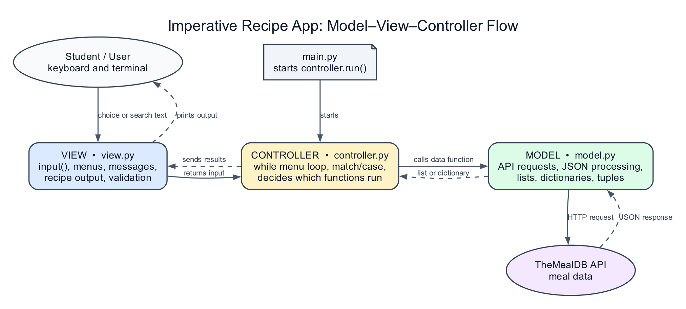

# Homework 1: Meal Explorer with Procedural MVC

Build a beginner command-line program that explores recipes from TheMealDB.
The starter separates the program into Model, View, and Controller files, but
it uses **imperative programming only**. You will use functions and Python
collections. You must not create classes.

## Learning objectives

This homework practices:

- variables, constants, basic data types, and scope;
- strings, string methods, and f-strings;
- lists, dictionaries, and tuples;
- `if`/`else` conditionals and `match`/`case`;
- `while` and `for` loops;
- functions, parameters, return values, and imports;
- keyboard input and validation; and
- `try`/`except`/`else` error handling.

## What does MVC mean here?

MVC separates three jobs. In this homework, each job is a Python file with
ordinary functions.

| File | Job | Examples |
| --- | --- | --- |
| `model.py` | Gets and prepares data | API requests, meal dictionaries, ingredient lists |
| `view.py` | Communicates with the user | `input`, menus, messages, recipe output |
| `controller.py` | Decides what happens next | menu loop, `match`, calls model and view |
| `main.py` | Starts the program | calls `controller.run()` |



The direction of communication is:

```text
main.py -> controller.py -> model.py
                       \-> view.py
```

The model never prints or asks for input. The view never calls the API. The
controller connects them.

## Project files

```text
meal_explorer_mvc/
├── main.py
├── controller.py
├── model.py
├── view.py
├── requirements.txt
└── README.md
```

## Setup and run

Python 3.10 or newer is required for `match`/`case`.

```bash
python3 -m venv .venv
source .venv/bin/activate          # Windows: .venv\Scripts\activate
python -m pip install -r requirements.txt
python main.py
```

Choose option `1` first to test the supplied category API example.
Option `4` will display a random recipe after you complete
`show_random_meal()` and ingredient parsing.

To test the view without the API, run `python view.py`. Its
`if __name__ == "__main__":` block displays two sample categories. That
sample does not run when the controller imports the view.

## How the API connection works

The API connection is complete in `model.py`:

```python
response = requests.get(
    BASE_URL + endpoint,
    timeout=REQUEST_TIMEOUT,
)
response.raise_for_status()
data = response.json()
```

All model functions must use `fetch_json`. Do not copy `requests.get` into
other functions. TheMealDB documents test key `1` for development and
educational use, so students do not need an account or secret key:
https://www.themealdb.com/api.php

Every endpoint starts with `/`, for example `fetch_json("/categories.php")`.
The base URL does not end with `/`. When an endpoint includes user text, use
the supplied `quote()` helper to encode spaces and punctuation safely.
Expected request and JSON failures return `None`; the controller and view
display user messages.

The category examples return name strings. Name/area/ingredient searches
return meal dictionaries so recipe details or meal IDs remain available.

## Your tasks

Study the completed category examples, then complete the remaining `TODO` tasks.

### Task 1: Ingredients in `model.py`

Complete `extract_ingredients(meal)`. Use a `while` loop to read
`strIngredient1` through `strIngredient20`. Build each key with an f-string.
Return a list of `(measure, ingredient)` tuples.

### Task 2: Categories in `model.py`

Study the completed `get_categories()` example. It requests `/categories.php`,
uses a `for` loop, and returns a list of category-name strings.

### Task 2b: Category filtering in `model.py`

Study the completed `get_meals_by_category(category)` example. It uses
`fetch_json(f"/filter.php?c={quote(category)}")` and returns meal-name
strings, or `[]` when unavailable.

The supplied controller shows a simple selection loop with `try`/`except`/
`else`, `case 0`, and a range guard. It reuses the category list rather than
fetching it again each time. The view displays category numbers and meal names.

### Task 3: Name search in `model.py`

Complete `search_meals_by_name(search_term)` with:

```python
data = fetch_json(f"/search.php?s={quote(search_term)}")
```

Return an empty list after an error or when the API returns no matches.

### Task 4: Meal selection in `view.py`

Complete `choose_meal(meals)`. Display numbered meal names, call the supplied
`read_number`, and return the selected dictionary. The displayed numbers start
at 1, but list indexes start at 0.

### Task 4b: Recipe display in `view.py`

Complete `display_meal(meal, ingredients)`. Display the recipe details and
ingredient measurements with f-strings. Handle missing information and an
empty ingredient list, and use `DIVIDER` to keep the output readable.

### Task 5: Search workflow in `controller.py`

Complete `search_for_meal()`. Follow its seven numbered comments.
This function must coordinate the model and view; it must not call
`requests.get` or `input` directly.

### Task 5b: Random meal workflow in `controller.py`

Complete `get_random_meal()` in `model.py`. Request `/random.php`, handle
unavailable results, and return one meal dictionary or `None`.

Complete `show_random_meal()`. Fetch a meal through the model, handle an
unavailable result, and send the meal and its extracted ingredients to the view.

### Task 6: Area and ingredient lists

Complete the model functions `get_areas()` and `get_ingredients()`:

| Function | API call | Response list | Name field |
| --- | --- | --- | --- |
| `get_areas()` | `fetch_json("/list.php?a=list")` | `meals` | `strArea` |
| `get_ingredients()` | `fetch_json("/list.php?i=list")` | `meals` | `strIngredient` |

Return lists of name strings. Handle failed requests and missing results.
Complete their display functions in `view.py` and their `show_` functions
in `controller.py`.

### Task 7: Area and ingredient searches

Complete `search_meals_by_area(area)` and
`search_meals_by_ingredient(ingredient)` in the model.

- Area search: `fetch_json(f"/filter.php?a={quote(area)}")`.
- One-ingredient search: `fetch_json(f"/filter.php?i={quote(ingredient)}")`.

Return meal-summary lists, or `[]` when unavailable. Strip ingredient text
and replace spaces with underscores.

### Task 8: Full recipe lookup

Complete `lookup_meal_by_id(meal_id)` using
`fetch_json(f"/lookup.php?i={meal_id}")`. Return the first meal dictionary,
or `None` when unavailable.

Unlike name searches, filter results do not include full recipes. Read the
selected summary's `idMeal` and use this lookup before displaying it.

### Task 9: New controller workflows

Complete `search_for_meal_by_area()` and
`search_for_meal_by_ingredient()`. Follow the TODO steps for input, filtering,
selection, lookup, and display. The menu cases are already connected.

## Required behavior

Your completed program must:

1. List meal categories.
2. List meals for a selected category; 0 returns to the main menu.
3. Search meals by name and allow the user to choose one result.
4. Display a random recipe.
5. List meal areas.
6. List the API's ingredient catalog.
7. Search meals by area and display a selected full recipe.
8. Search meals by one ingredient and display a selected full recipe.
9. Reject invalid menu options and invalid numbered choices without crashing.
10. Exit cleanly when the user enters `0`.

## Simple controller structure

`run()` only repeats the menu. It calls `handle_menu_choice(choice)`, which
contains the main `match` statement and calls one action function per case.
The handler returns `True` to continue and `False` to exit.

The category-selection action has its own loop. Returning from that loop does
not exit the entire application.

## Rules

- Do not create classes or dataclasses.
- Keep model, view, and controller responsibilities separate.
- Do not store meal data in global variables.
- Do not hard-code API results.
- Keep the supplied function names so the modules continue to work together.
- Use descriptive `snake_case` variable names.

## Rubric (100 points)

| Area | Points |
| --- | ---: |
| Model functions and API data | 25 |
| View functions and input validation | 20 |
| Controller logic and `match` menu | 20 |
| Lists, dictionaries, tuples, strings, and f-strings | 15 |
| Loops, conditionals, scope, and error handling | 15 |
| Readability and MVC separation | 5 |

## Optional challenge

Let the user choose one of the category-filter results and view its full
recipe. First preserve the summary dictionaries instead of only their names
and update the category display to match. Then use the selected `idMeal`
with `fetch_json(f"/lookup.php?i={meal_id}")` before displaying the recipe.
